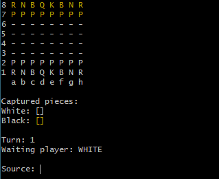

# Jogo de Xadrez em Java

## Introdução

Este projeto foi desenvolvido como parte do **Curso Java Completo** ministrado pelo Prof. Dr. Nelio Alves na plataforma Udemy. Ele consiste na implementação de um jogo de **xadrez** baseado em conceitos de **Programação Orientada a Objetos (POO)**, utilizando **Java** e execução via terminal.

O repositório com as atividades relacionadas ao curso pode ser acessado [aqui](https://github.com/hvgofernandes/chess-system-java).

## Sobre o Projeto

O projeto simula um jogo de xadrez jogável pelo terminal, implementando funcionalidades como:
- **Tratamento de erros** e programação defensiva.
- **Movimentação e regras especiais** (promoção, roque e en passant).
- **Previsão de movimentos das peças**.
- **Sistema de Check e CheckMate**.

A mecânica do jogo é baseada em **linhas** (1 a 8) e **colunas** (a a h). Para escolher uma peça, o jogador deve informar a **coluna** seguida da **linha** (exemplo: `c2`).



## Estrutura do Projeto

O código está organizado em pacotes conforme a seguinte estrutura:

- **src**: Contém os pacotes e classes do projeto.
    - **boardlayer**: Camada responsável pelo tabuleiro e controle das peças.
        - `Position`: Representa uma posição no tabuleiro.
        - `Piece`: Classe abstrata que representa uma peça.
        - `Board`: Define o tabuleiro e seu estado.
        - `BoardException`: Trata exceções relacionadas ao tabuleiro.

    - **chesslayer**: Camada responsável pelas regras do xadrez.
        - `ChessPiece`: Classe base para as peças de xadrez, herdando de `Piece`.
        - `ChessMatch`: Controla a lógica do jogo (turnos, check, checkmate).
        - `ChessPosition`: Representa a posição no formato amigável (exemplo: `a2`).
        - `ChessException`: Trata exceções do jogo.
        - **Peças do jogo**: `King`, `Queen`, `Bishop`, `Knight`, `Rook`, `Pawn` (herdam de `ChessPiece`).

- **UI**: Controla a interface do jogo no terminal, exibindo tabuleiro e mensagens.

## Regras do Jogo

1. O **turno** começa sempre com as peças **brancas**.
2. O jogador deve inserir a **posição de origem** da peça (exemplo: `a2`).
3. O jogo exibe os movimentos possíveis da peça escolhida.
4. O jogador informa a **posição de destino** da peça (exemplo: `a4`).
5. Após um movimento válido, o turno passa para o próximo jogador.
6. Peças capturadas são armazenadas e exibidas.
7. O jogo reconhece situações de **Check** e **CheckMate**.

## Diagrama UML


## Tecnologias Utilizadas

- **Java**
- **POO (Herança, Polimorfismo, Encapsulamento, Abstração)**
- **Tratamento de Exceções**
- **Estruturas de Dados (Listas, Matrizes, Enumerações)**

## Como Rodar o Projeto Localmente

1. Clone o repositório:
   ```bash
   git clone https://github.com/hvgofernandes/chess-system-java
   ```
2. Entre no diretório do projeto:
   ```bash
   cd xadrez-java
   ```
3. Importe o projeto em sua IDE Java preferida (Eclipse, IntelliJ, etc.).
4. Compile e execute a aplicação:
   ```bash
   javac application/Program.java
   java application/Program
   ```

## Aprendizados

Durante o desenvolvimento deste projeto, foram reforçados os seguintes conceitos:

- **Modelagem de um sistema em camadas**.
- **Uso de classes abstratas e herança** para representar peças do xadrez.
- **Conversão entre coordenadas da matriz e notação de xadrez**.
- **Boas práticas de código, como encapsulamento e tratamento de exceções**.
- **Implementação de regras complexas dentro da lógica de jogo**.

---

